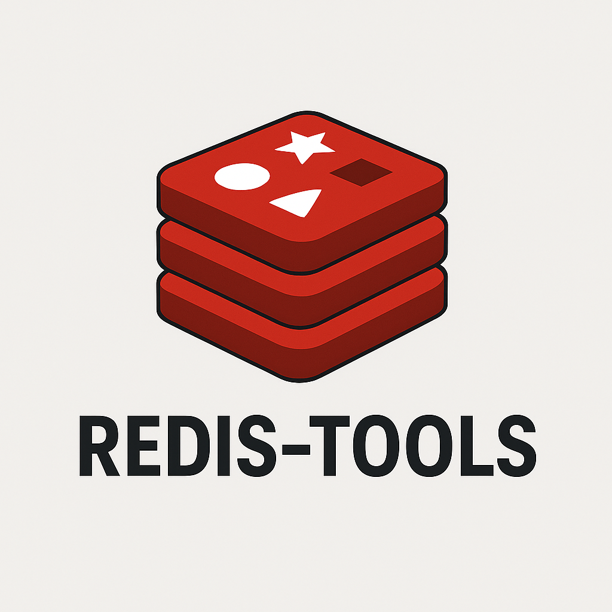

<p align="center">
    <a href="" target="_blank">
      
    </a>
</p>
<h1 align="center">Redis-Tools</h1>
<p align="center"><strong>致力于简化Redis工具的使用，提供丰富的多种多样的组件和功能<br><em>持续更新中～</em></strong></p>
<div align="center">
    <a href="https://github.com/AlfonsoKevin/redis-tools"></a></div>


---


## 介绍

---

🚀 专为高效开发打造的Redis工具库 | 基于Redisson深度封装 | 让分布式开发更优雅

## 目录结构&设计🚀

```txt
└─📁 src
  └─📁 main
    └─📁 java
      └─📁 io
        └─📁 github
          └─📁 alfonsokevin
            └─📁 core
              ├─📁 config           # Redis的配置
              ├─📁 limiter          # Redis限流速率器工具类
              └─📁 utils            # Redis的基础工具类
```


### ✨详细介绍 & 核心价值

作为平日开发中的一员，提炼出**高频使用但实现繁琐**的Redis操作场景，结合Redisson的优秀特性进行二次封装，为您带来：

- **🔌 无缝Spring集成** - 注解驱动配置，与Spring Boot生态完美契合
- **💡 开箱即用的最佳实践** - Redisson的限流速率器的注解式实现/功能扩展...
- **⚡ 性能优化**-静态缓存构造器等预先调优

#### 😎 目前实现的功能

- 基于Redisson的速率限流器，可自定义异常信息，自定义Key的策略(自定义key/SpringEL表达式解析)，目前提供了默认的限流算法进行计算，后期将完善其他的限流算法和进一步扩展。
- Redis的构建key的封装
- 其他，提供了SpringEL表达式的工具类

### 🚀快速开始

等待将依赖推送到中央仓库。正确配置即可使用。

1.引入依赖

```xml
<dependency>
    <groupId>io.github.alfonsokevin</groupId>
    <artifactId>redis-tools</artifactId>
    <version>1.0.0-RELEASE</version>
</dependency>
```

2.环境中配置redis的配置 (查看RedisToolsProperties)

```yml
redis:
  tools:
    config:
      host: ${redis.tools.config.host}
      port: ${redis.tools.config.port}
      password: ${redis.tools.config.password}
```

3.Spring 默认**不会自动扫描外部 jar 包中的类**，需要在引导类中指定包路径

```java
@SpringBootApplication(scanBasePackages = {"io.github.alfonsokevin"})
```

### 🤖最近更新
- 2025/4/24 发布到中央仓库，补充Redis基础工具类(很少一部分，期待后续完善)，规范日志输出，调整Bean名称
- 2025/4/24 Debug: 原配置的 @ConditionalOnClass(RedissonClient.class) 条件错误，导致自动配置仅在 Redisson 已存在时触发。若项目没有将会抛出异常。
- 2025/4/24 Debug: 自定义Bean名称后未修改完全使得会出现NPE
### 待办清单 TODO

- 完善限流策略的不同算法补充..

### 注意事项

- This project is licensed under the MIT + Commons Clause – see the [LICENSE](LICENSE) file for details.
- 欢迎贡献代码或者提出建议，您可以通过提出 Issue 或者 Pull Request 的方式参与到项目中来。

## 参与贡献

如果您对项目有任何建议或想要贡献代码，欢迎提交 Issue 或 Pull Request。

---

感谢您对该项目的关注和支持！🕵️‍♀️
